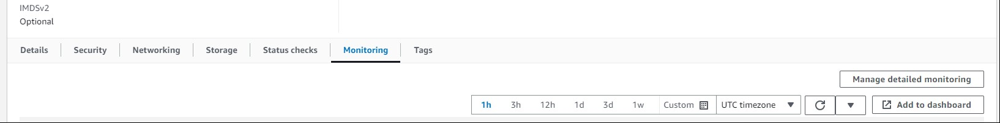

# AWS Cloudwatch - Monitoring

## Setting up a dashboard

1) Create an instance and get it running.

### Locating the dashboard

2) Go to your instance summary page.
3) Scroll roughly halfway down the page until you see a ribbon that by default should be on the `Details` tab.
4) Click on the `Monitoring` tab.

### Setting up detailed monitoring

- **NOTE** Detailed monitoring costs more money to run than regular monitoring.

5) Click on the button that says `Manage detailed monitoring`.
6) A window called "Detailed monitoring" should come up on screen.
7) Click the tick box to **Enable** detailed monitoring.
8) Click `Confirm`.

### Making a dashboard

9) Click on `Add to dashboard`.
10) A window called "Add to dashboard" should come up on screen **(NOTE: If this window doesn't come up then go a page back and try again)**.
11) Click on `Create new`.
12) Name your dashboard using appropriate naming conventions. e.g. `tech254-alex-test-dashboard`.
13) Click `Create`.
14) Click `Add to dashboard`.



### Notes

- You can utilise the different elements of the dashboard better by maximising the view and changing elements of the view.

## Setting up an alarm

### Alarm based on CPU Usage

1) Go to your AWS Console and open `Cloudwatch`.
2) In the Navigation pane on the left hand side of the console, click on `Alarms` then click on `All Alarms`.
3) Click on `Create alarm`.
4) Click on `Select Metric`.
5) In `All metrics`, choose `EC2 metrics`.
6) Choose a category e.g. `Per-instance metrics`.
7) Select the CPUUtilisation metric.
8) Link to your EC2 instance.
9) Under "Specify metric and conditions", for statistic choos "Average" and specify a percentile of your choice (1m, 5m etc...)
10) Under "Conditions", specify:
````
Threshold Type = static

CPUUtilisation is - Greater than - (Specify percentage)
````
11) Under Notification, choose In alarm and select an SNS topic to notify when the alarm is in ALARM state.
- On the first occasion you will need to make an SNS topic and add your email address.
12) Give your alarm a name and description. e.g.
````
tech254-alex-test-alarm
````
13) Go to "Preview and create"
14) Click create alarm
15) When the CPU goes over the specified limit, you will receive the following email:


**NOTE** - On the first occasion you will be sent an email to confirm your email address.

16) DELETE your alarms when they are no longer needed.

