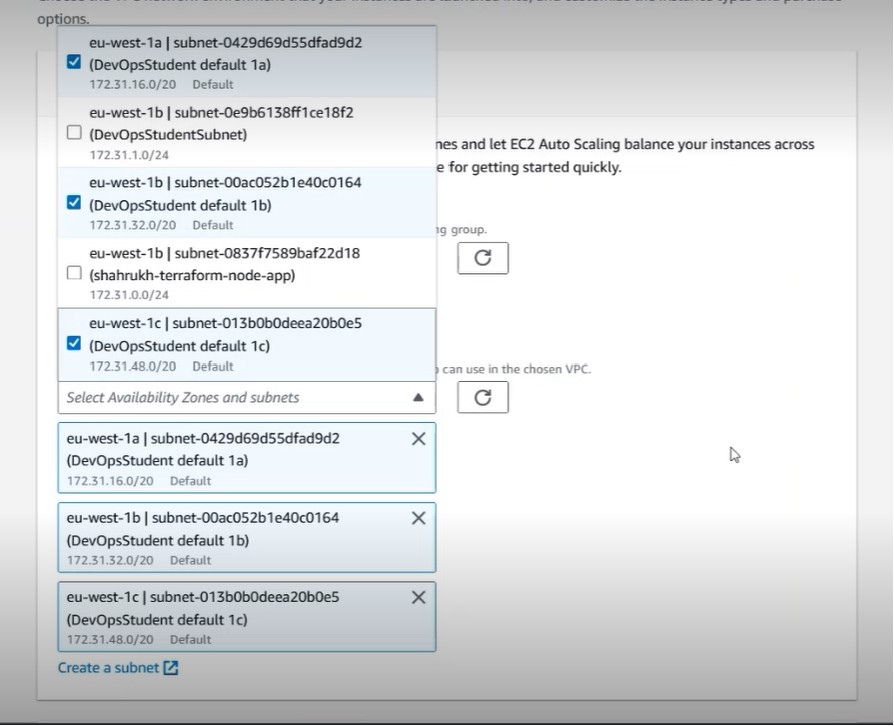
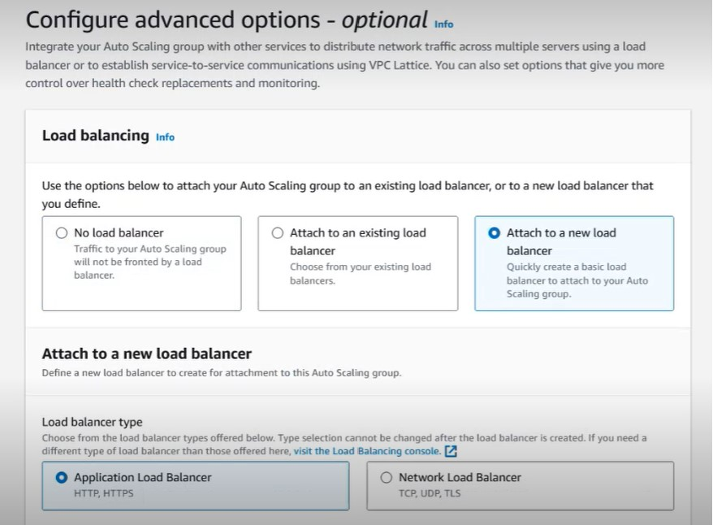
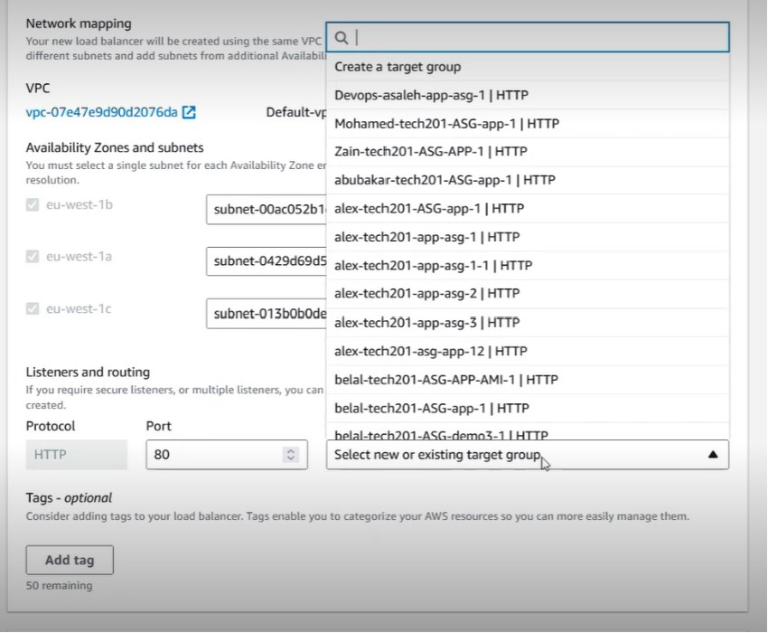

# Autoscaling and Load Balancing steps on AWS

## AWS Auto Scaling Group - Deploy app with HA + SC (High Availability + Scalability)

- Provision your instance to run an app
- Make an AMI of this instance
- Use a launch template to pre fill all the boxes on the launch instance page

### Auto scaling group

- Choose the group size (minimum, maximum, desired number of VMs to be made)
- Create the VMs
- Each VM can be in a different Availability Zone (e.g. AZ1a, AZ1b, AZ1c)
- Scaling policy - Sets the threshold (in this case 50%) to monitor the CPU usage

## Autoscaling steps

1) **Go to the EC2 console on AWS.**
2) **On the left hand pane, scroll down to `Auto Scaling Groups` and click on it.**
3) **Click on `Create Auto Scaling group`.**
4) **STEP 1 - Choose launch template or configuration.**
- Name the autoscaling group using the proper naming conventions (use hyphens)
````
tech254-alex-app-first-asg
````
- Select the launch template you made earlier.
- Click `Next`.


5) **STEP 2 - Choose instance launch options.**
- Under "Network", keep VPC the same
- Under "Network", add the 3 default subnets (DevOps student default (1a, 1b, 1c))
- Leave Instance type requirements the same
- Click `Next`.



6) **STEP 3 - Configure advanced options.**
- Under "Load balancing", select `Attach to a new load balancer`.
- Select `Application Load Balancer`.
- Give the load balancer a name using normal naming conventions e.g. `tech254-alex-app-first-asg-lb`.
- Change "Load balancer scheme" to `Internet-facing`.



- Leave "Availability zones and subnets" alone.
- Under "Listeners and routing", change the default routing to a new target group.
- On the dropdown list, click `Create a target group`. Give this target group a name e.g. `tech254-alex-app-first-asg-lb-tg`.



- Ignore VPC lattice.
- Under "Health Checks", Turn on elastic load balancing (Recommended).
- Click `Next`.
7) **STEP 4 - Configure group size and scaling policies**
- Under "Group size", input the following:
````
Desired capacity = 2
Minimum capacity = 2
Maximum capacity = 3
````
- Under "Scaling policies", turn on `Target tracking scaling policy` and make sure target value is `50`.
- Ignore "Instance scale-in protection".
- Click `Next`.
8) **STEP 5 - Add notifications**
- Ignore this step.
9) **STEP 6 - Add tags**
- Click on `Add tag`
- Add the following:
````
Key = Name
Value = tech254-alex-first-asg-HA-SC
````
- Click `Next`.
10) **STEP 7 - Review**
- Double check everything is as it should be.
- Click `Create Auto Scaling group`.

**NOTE: Put the DNS name into the URL browser instead of the instance IP to open the page**

## Deletion

1) On the left hand pane in the EC2 console, Scroll down to "Load Balancing" and click on `Load balancers`.
2) Search for your load balancer e.g. `tech254-alex-app-first-asg-lb` and go to `Actions` and click on delete load balancer (you will need to type in "confirm").
3) Under "Load balancing", click on `target groups` and delete the target group under your name. "Actions" then `delete`.
4) Under "Auto Scaling groups", search for the ASG with your name and go to "Actions" then delete (will need to type delete to confirm).

## Monitoring - Worst to Best practice

